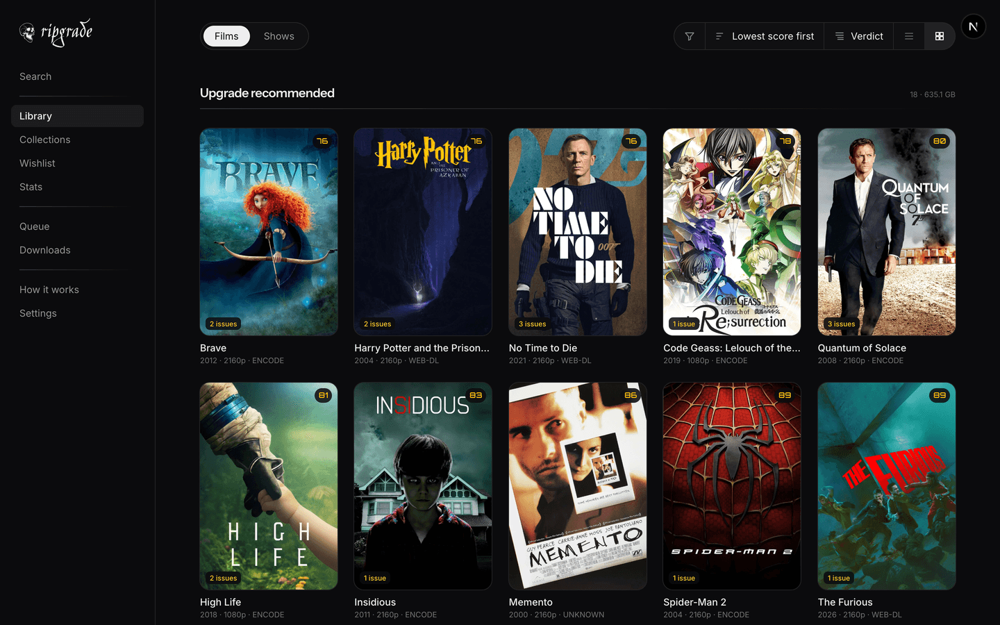
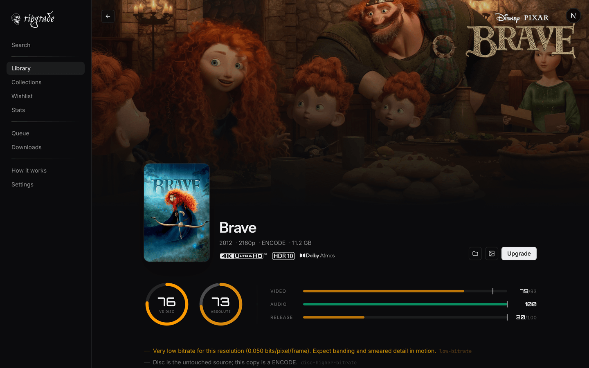
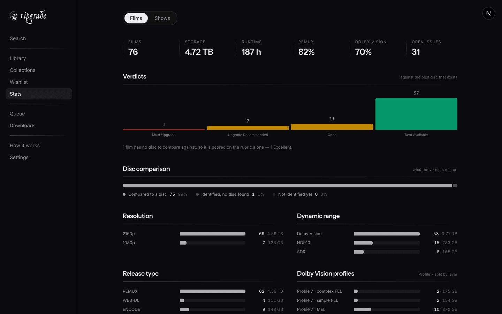
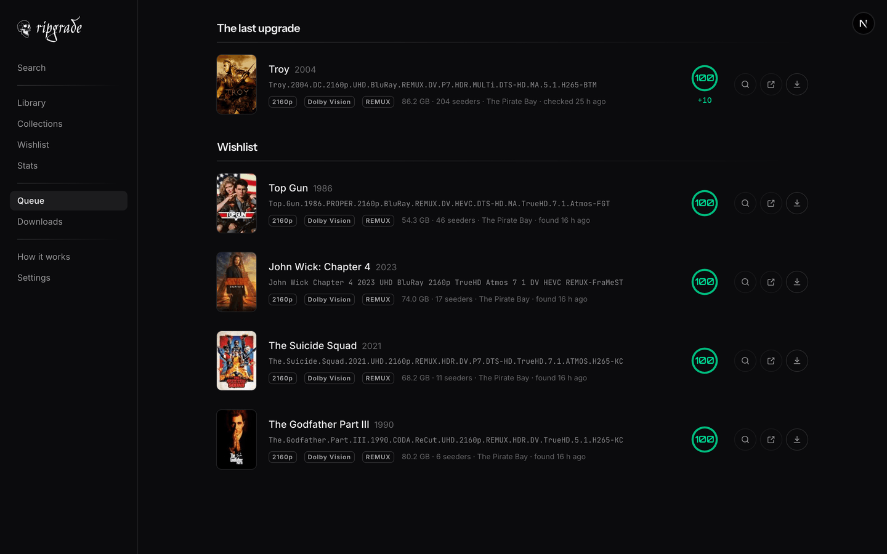
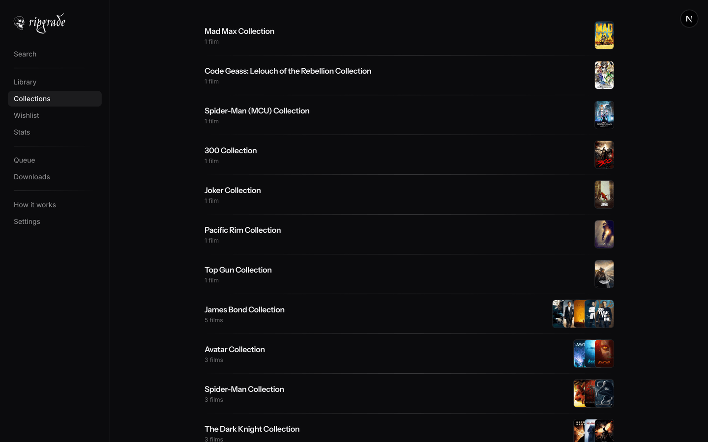
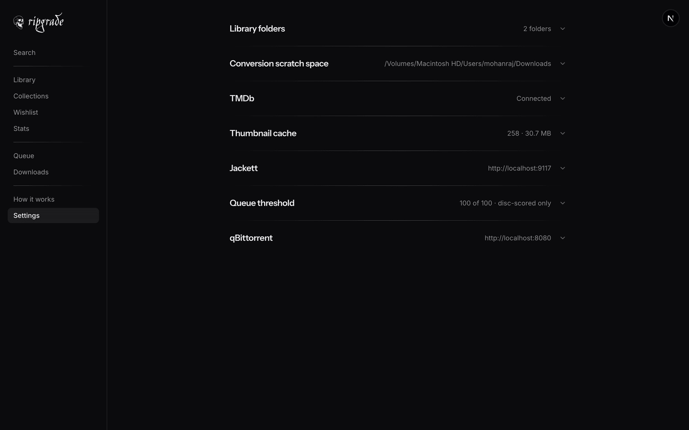

<div align="center">


<br>

**A local-first audit of the technical quality of your film and television library.**

It reads every file on the drive, works out what each one actually *is* — resolution, dynamic range,
Dolby Vision profile, codec, bitrate-per-pixel, lossless audio — and grades it against the best disc
that was ever pressed of that title. Then it tells you which copies are worth replacing, and helps
you replace them.

<br>


</div>

---

## Contents

| | |
|---|---|
| **[Screenshots](#screenshots)** | What you are setting up |
| **[Requirements](#requirements)** | Node, and five command-line tools |
| **[Quick start](#quick-start)** | Four commands and a browser tab |
| **[First run](#first-run)** | Point it at a drive, give it a TMDb token |
| **[Installing it as an app](#installing-it-as-an-app)** | Add to Dock, and what works offline |
| **[How your files should be laid out](#how-your-files-should-be-laid-out)** | Naming that the scanner can read |
| **[Optional integrations](#optional-integrations)** | Jackett, qBittorrent, `dovi_convert` |
| **[Running it in Docker](#running-it-in-docker)** | The tools, Jackett and a VPN, in one `up` |
| **[What a scan actually does](#what-a-scan-actually-does)** | The eight phases, in order |
| **[How the score is built](#how-the-score-is-built)** | Weights, bands, verdicts |
| **[Project layout](#project-layout)** | Where things live |
| **[Scripts](#scripts)** | `dev`, `build`, `start`, `lint`, `test` |
| **[Data, caches and resetting](#data-caches-and-resetting)** | Everything is regenerable, except two tables |
| **[Troubleshooting](#troubleshooting)** | The failures you are most likely to hit |

---

## Screenshots

<div align="center">



<sub>**Library** — every file, graded, grouped by verdict, worst first.</sub>

<br><br>



<sub>**A film** — two scores (against the disc, and absolute), the three components behind them, and the specific issues found.</sub>

<br><br>

<table>
<tr>
<td width="50%"></td>
<td width="50%"></td>
</tr>
<tr>
<td align="center"><sub><b>Stats</b> — verdicts, resolutions, dynamic range, DV profiles.</sub></td>
<td align="center"><sub><b>Queue</b> — the better release that exists, ready to hand to qBittorrent.</sub></td>
</tr>
<tr>
<td width="50%"></td>
<td width="50%"></td>
</tr>
<tr>
<td align="center"><sub><b>Collections</b> — franchises as TMDb defines them, with the gaps.</sub></td>
<td align="center"><sub><b>Settings</b> — every knob, in the order you meet them.</sub></td>
</tr>
</table>

</div>

---

## Requirements

### Platform

**macOS.** Not a preference — the app shells out to `open -R` to reveal files in Finder, and it
expects external drives under `/Volumes`. Everything else is portable; those two are not.

### Runtime

| | Version | Why |
|---|---|---|
| **Node.js** | `>= 20.9` | Next.js 16 requires it. `node -v` to check. |
| **npm** | ships with Node | Any package manager works; the lockfile is npm's. |

### Command-line tools

Installed with [Homebrew](https://brew.sh). The first is required; the rest unlock features.

| Tool | Formula | Required? | What it does here |
|---|---|:---:|---|
| **MediaInfo** | `brew install mediainfo` | **Yes** | The whole scan. Every codec, resolution, HDR format, audio track and encoder string comes from one `mediainfo --Output=JSON` call per file. Without it, nothing is graded. |
| **ffmpeg** | `brew install ffmpeg` | Recommended | Demuxes the HEVC stream so the Dolby Vision RPU can be read. Without it, DV files are graded from the container's profile alone. |
| **dovi_tool** | `brew install dovi_tool` | Recommended | Parses that RPU — the enhancement-layer type (MEL / simple FEL / complex FEL), CM version, L1 light levels and per-frame coverage. This is what decides whether a Profile 7 file can be safely flattened. |
| **dovi_convert** | `brew install dovi_convert` | Optional | Runs the Profile 7 → 8.1 conversion from inside the app, and the rebuild back out of it. It keeps the original beside the result, refuses a complex FEL on its own, and — when asked — sets the discarded enhancement layer aside in an archive small enough to keep for good. |
| **MKVToolNix** | `brew install mkvtoolnix` | Optional | Only for the by-hand conversion recipe the app prints (`mkvmerge`). Not called by the app itself. |

All five in one go:

```bash
brew install mediainfo ffmpeg dovi_tool dovi_convert mkvtoolnix
```

Or skip all five — [the Docker image](#running-it-in-docker) has them baked in.

### Accounts

| | Cost | Needed for |
|---|---|---|
| **TMDb read access token** | Free | Titles, posters, backdrops, collections, episode lists, runtimes. Sign in at [themoviedb.org](https://www.themoviedb.org/settings/api) and copy the **API Read Access Token** (the long v4 JWT — *not* the short v3 API key). |

---

## Quick start

```bash
# 1. Clone
git clone <your-remote> ripgrade && cd ripgrade

# 2. Install the command-line tools
brew install mediainfo ffmpeg dovi_tool

# 3. Install dependencies
npm install

# 4. Run it
npm run dev
```

Open **<http://localhost:3000>**.

The library will be empty — that is expected. Nothing has been pointed at a drive yet.

> [!NOTE]
> There is no `.env` to fill in to get started. The TMDb token and both integrations are configured
> from the **Settings** page and stored in the local database, because the one setting standing
> between a fresh install and every poster in your library should not be one that requires a
> server restart.

---

## First run

### 1 · Add your library folders

**Settings → Library folders → Add folder.**

A folder browser opens at `/Volumes`, so external drives are one click away. Add as many as you
like — a collection outgrows a drive, and the app has no opinion about them living together.

Then press **Scan library**, in the same section. (Adding a folder only registers it; the scan is
the deliberate step, and it also runs by itself on every server start.)

### 2 · Paste your TMDb token

**Settings → TMDb.**

Paste the v4 read access token and save. The app checks it before storing.

Until this is set the library still works — files are probed and graded on the rubric alone — but
there are no posters, no titles beyond what the filename says, no collections, and no disc
comparison. It is worth doing first.

### 3 · Let it finish

The first scan is the slow one: every file is read by MediaInfo, every Dolby Vision file has its
RPU head-scanned, every title is matched against TMDb, artwork is downloaded and Blu-ray.com is
asked what the best pressing of each film was. Progress runs in the left rail throughout.

Every scan after that reuses the cache and only re-probes files whose size or modification time
changed.

> [!TIP]
> **The app rescans itself on every start.** The drive changes while the app is not running, so
> booting it is what refreshes it. The button in Settings is for when you have just moved a file
> and do not want to wait.

---

## Installing it as an app

RipGrade ships a web app manifest, so it can leave the browser and live in the dock with its own
icon and its own window — no address bar, no tab strip, and a name in the menu bar.

**macOS, Safari** — open the app, then **File → Add to Dock**. Safari picks up the name, the skull
and the window shape from the manifest. This is the one that behaves most like a native app: it
gets a Dock icon you can keep, and ⌘Q quits it.

**Chrome, Edge, Arc** — an install button appears at the right of the address bar, or use
**⋮ → Cast, save and share → Install page as app**. Right-clicking the resulting icon offers
Library, Queue and Jobs directly.

> [!NOTE]
> Service workers — and so the offline page below — only run on a *secure* origin. `localhost`
> counts as one; the same app opened from another machine at `http://your-nas.local:6969` does not,
> unless you put it behind HTTPS. Installing to the dock works either way.

The one thing cached is a fallback page shown when the server cannot be reached at all — the
machine it runs on is asleep, or the laptop is off the network. Nothing about the library is stored
offline, because none of it would still be true by the time you read it.

---

## How your files should be laid out

The scanner walks each library folder recursively and picks up
`.mkv .mp4 .m4v .avi .mov .ts .m2ts .mpg .mpeg .wmv .webm`.

### Films

One film per folder, named so the title and year are recoverable:

```
/Volumes/Films/
├── Dune Part Two (2024)/
│   ├── Dune.Part.Two.2024.2160p.UHD.BluRay.REMUX.DV.HDR.TrueHD.7.1.Atmos-GROUP.mkv
│   ├── poster.jpeg          ← optional; downloaded from TMDb if absent
│   ├── fanart.jpeg          ← optional
│   └── logo.png             ← optional (`clearlogo.png` is also recognised)
└── Heat (1995)/
    └── Heat.1995.2160p.UHD.BluRay.REMUX.DV.HDR.DTS-HD.MA.5.1-GROUP.mkv
```

Scene-style release names are read, not merely tolerated: `REMUX`, `WEB-DL`, `BluRay`, `2160p`,
`REPACK`, `PROPER` and encoder tags all feed the **release score**. A filename claiming `REMUX`
over an x265 stream is caught and reclassified — the container is checked against the claim.

### Television

Season folders inside a show folder, episodes numbered `SxxEyy`:

```
/Volumes/Shows/
└── Severance/
    ├── Season 01/
    │   ├── Severance.S01E01.2160p.ATVP.WEB-DL.DV.HDR10+.DDP5.1.Atmos-GROUP.mkv
    │   └── Severance.S01E02...
    └── Season 02/
```

`Season 01`, `season.1`, `S01` and similar all match. The show folder — the one above the season
folders — is where artwork is looked for.

---

## Optional integrations

Both can be named in the environment. For **Jackett** that is a default rather than a lock: the
Settings page wins, so a stack that ships its own Jackett works on the first page load and you can
still paste a new key when one rotates — **Use the environment** puts it back. **qBittorrent** is
still read from the environment first, falling back to Settings.

### Jackett — finding better releases

[Jackett](https://github.com/Jackett/Jackett) is a local proxy that holds your indexer logins and
exposes them all as one Torznab feed. RipGrade talks to one URL on your own machine and never
contacts a tracker directly. Everything it does is read-only: a search returns names, sizes and
links.

**Settings → Jackett** — paste the URL (typically `http://localhost:9117`) and the API key from
Jackett's own dashboard.

Once connected, the **Queue** page fills itself: a sweep searches for a better copy of every film
below your score threshold, and the wishlist pass searches for the films you do not have yet.

### qBittorrent — sending the release

**Settings → qBittorrent** — paste the WebUI URL (typically `http://localhost:8080`). Username and
password are optional: qBittorrent's *bypass authentication for localhost* is common, and demanding
credentials it will not ask for is a hurdle for nothing.

Everything sent from the app is tagged with the category `ripgrade`, so the queue's **Wishlist** tab only
ever lists what it added. Your other torrents are none of its business.

### Environment defaults

Create `.env` in the project root to have these set for you:

```bash
JACKETT_URL=http://localhost:9117
JACKETT_API_KEY=your-jackett-api-key

QBITTORRENT_URL=http://localhost:8080
QBITTORRENT_USERNAME=admin
QBITTORRENT_PASSWORD=your-password
```

The Jackett pair is a starting point: connecting Jackett from Settings replaces it, and
disconnecting there goes back to it. The qBittorrent trio still overrides Settings.

> [!IMPORTANT]
> The TMDb token is **deliberately** not readable from the environment. It lives in the database and
> is set from Settings, so there is exactly one place it comes from and one place to change it.

### dovi_convert — flattening Profile 7

With `dovi_convert` installed, a Profile 7 film's page gains a working **Convert** console: it runs
a full-frame RPU scan first, then hands the whole job to `dovi_convert`, which renames the original
aside rather than deleting it and verifies the result before declaring success.

**Settings → Conversion scratch space** picks where the working video file lands — a 90 GB remux
needs somewhere to go, and that is not a decision an audit tool should make for you.

**Settings → Going back to Profile 7** decides whether a conversion keeps the enhancement layer it
discards. On by default, the layer is pulled out into a `Film.dovi` archive beside the film first — a
tenth to a quarter of the film for a FEL, a couple of gigabytes for a MEL — and the film's page then
offers **Rebuild Profile 7**, which puts the layer back into the base layer and remuxes the two into
a Profile 7 file again. That is what makes deleting the 90 GB original a reversible decision rather
than a final one. Turning it off saves a pass over the whole film before every conversion, at the
price of a conversion that is final once that original has gone.

Without it, the same page still prints both recipes (`dovi_convert`, and the by-hand
`ffmpeg | dovi_tool` + `mkvmerge` pair) ready to copy into a terminal — and, on a film with its
layer kept, the two that rebuild it.

---

## Running it in Docker

The five command-line tools are the fiddly half of the install, so there is an image with all of
them already in it: MediaInfo and ffmpeg and mkvmerge from Debian, `dovi_tool` as its static
release binary, and `dovi_convert` — which turns out to be one Python file with nothing but the
standard library behind it — fetched at build time. Nothing to `brew install`.

`docker-compose.yml` brings up three containers and one that exits:

| | What it is |
|---|---|
| **dns** | CoreDNS, forwarding every lookup over TLS to Cloudflare. Not a VPN, and that is the point — see below. |
| **jackett-init** | Runs once, before Jackett, and puts the API key and a starter set of indexers where both sides can find them. Then it is gone. |
| **jackett** | The indexer proxy, told to resolve through `dns` and nothing else. |
| **ripgrade** | The app, with the drive bound in. On the default resolver: TMDb and Blu-ray.com are not names anybody is blocking. |

```bash
cp .env.docker.example .env    # a key you generate, and where Jackett keeps its config
docker compose up -d --build
```

The app is on **<http://localhost:6969>**, Jackett's dashboard on **<http://localhost:9117>** —
on its own port, on the network it shares with the app.

Not 3000: that port belongs to `next dev`, and running the container and the dev server at the
same time should not be a choice. `RIPGRADE_PORT` in `.env` moves it.

### Three things worth knowing before you start

**The drive is bound at the same path it has on the host.** `/Volumes:/Volumes`, not
`/Volumes:/media` — so every absolute path already in the database still resolves, and a library
scanned outside the container is the same library inside it. Docker Desktop shares `/Volumes` by
default; if you have narrowed that, it is Settings → Resources → File sharing.

> [!IMPORTANT]
> A drive plugged in *after* the container started may not appear inside it — the share is
> established when the container is, and Docker Desktop does not always propagate a later mount.
> Mount the drive first, then `docker compose restart ripgrade`.

**There is no API key to go and fetch.** Ordinarily Jackett invents one on first start and you
open its dashboard to copy it out. Here you choose it instead:

```bash
openssl rand -hex 16      # into JACKETT_API_KEY in .env
```

`jackett-init` writes that key into Jackett's `ServerConfig.json` before Jackett has ever run, and
Jackett — which only generates a key when it does not already have one — keeps it. The same value
reaches the app as `JACKETT_API_KEY`, so the two come up already agreeing and **Settings → Jackett**
reads *Set by the environment* on the first page load.

It is safe on an existing install: the config is parsed and patched rather than rewritten, so the
indexers and the admin password survive a key change. Leave `JACKETT_API_KEY` blank and the old
behaviour is exactly what you get — Jackett generates its own, and you paste it into Settings.

> [!NOTE]
> `http://jackett:9117` is the address, not `localhost` — container to container, by service name.
> That is already in `.env.docker.example`.

**Three indexers come pre-configured**, for the same reason and by the same route: The Pirate Bay,
TorrentDownload and LimeTorrents. All three are public, so a configured one is nothing but a site
address and a sort preference — no login, nothing encrypted, nothing tied to the machine that
wrote it. The files in `docker/jackett-indexers/` are Jackett's own output, captured once, and
`jackett-init` copies them in before Jackett starts. The Queue works on the first page load.

Only ever into a *fresh* Jackett. Once it has indexers of its own, the set is yours — dropping one
you did not want should not be undone by the next `up`. `JACKETT_SEED_INDEXERS=0` starts empty.

**Private trackers stay manual**, and should: their configs carry logins, passkeys and cookies,
which is not something to keep in a repo. Add those at <http://localhost:9117>.

**No VPN, deliberately.** The trackers are blocked by name, not by address: the ISP answers one
sinkhole for `torrentdownload.info`, `1337x.to` and `thepiratebay.org` alike, and TLS then fails
against a block page. So the stack runs CoreDNS forwarding over TLS instead, and Jackett resolves
through it — a fix scoped to the one container that needed it, with no subscription and nothing
else on the machine rerouted. The diagnosis is in
[docs/Indexer_Connectivity_Fix.md](docs/Indexer_Connectivity_Fix.md).

### What you lose

**Reveal in Finder.** There is no Finder in a container, so the button is not drawn — everything
else on the film page works unchanged. Convert, audio strip and cleanup all write through the bind
mount, and the files land on the host owned by you.

### And the honest caveat

On **macOS**, every byte the app reads travels through Docker Desktop's file sharing. MediaInfo
only reads headers and barely notices. A `dovi_convert` run is a 90 GB remux through that same
mount, and it will be meaningfully slower than running the app natively. On Linux, where the drive
is just mounted, none of this applies.

### The rest of it

Rebuild costs, what survives a `down`, running the container and `next dev` side by side, and the
failures in the order they happen: **[docs/Docker_Runbook.md](docs/Docker_Runbook.md)**.

---

## What a scan actually does

Eight phases, in order, each visible in the left rail as it runs:

| # | Phase | What happens |
|:--:|---|---|
| 1 | **Walk** | Every library folder is walked recursively; video files are collected. Files that vanished since last time are marked absent. |
| 2 | **Probe** | `mediainfo --Output=JSON` per file. Cached by path + size + mtime, so unchanged files cost nothing on a rescan. |
| 3 | **Dolby Vision** | For DV files not yet read: `ffmpeg` demuxes the HEVC head and `dovi_tool` parses the first 300 frames. Under a second even on a 90 GB remux; everything structural is fixed at authoring time and correct from frame one. |
| 4 | **Match** | Each title is searched on TMDb. A result with no match is recorded as "searched, found nothing" so it is not retried every run. |
| 5 | **Artwork** | Missing posters, backdrops and logos are downloaded to sit beside the film. Files on the drive always win over anything cached. |
| 6 | **Discs** | Blu-ray.com is asked what the best commercial release of each film — and each season — actually is. Cached forever; refetching is slow and someone else's bandwidth. |
| 7 | **Sweep** | With Jackett connected, every film below the queue threshold is searched for a better release. |
| 8 | **Wishlist** | The films you want but do not have are searched for too. |

---

## How the score is built

Three components, weighted:

| Component | Weight | Built from |
|---|:--:|---|
| **Video** | 45% | Resolution (2160p 60 / 1080p 40 / 720p 22 / SD 10), dynamic range (Dolby Vision 22 / HDR10+ 20 / HDR10 15 / SDR 0), 10-bit, remux status, and bits-per-pixel-per-frame. |
| **Audio** | 30% | Lossless 65 / lossy 35, object-based formats (Atmos, DTS:X) +25, and channel count (8ch +10 / 6ch +6). |
| **Release** | 25% | REMUX 100, WEB-DL 72, unknown 45, and encodes graded 30 – 75 by bitrate density — using the encoder actually found in the stream, not the one the filename claims. |

The weighted total is then capped at **video + 15**, so no amount of Atmos rescues a bad picture.

Each file gets **two** numbers: an **absolute** score against the rubric, and a **vs disc** score
against the best pressing that exists. A 1080p file of a film never released above 1080p is not
punished for the resolution it could never have had.

The verdict comes from the score:

| Band | Verdict | Priority |
|:--:|---|---|
| **90 +** | Reference | None |
| **78 – 89** | Excellent | None |
| **62 – 77** | Good | Low |
| **45 – 61** | Upgrade Recommended | Medium |
| **0 – 44** | Must Upgrade | High |

Alongside the score, a catalogue of specific **issues** is checked — very low bitrate for the
resolution, a REMUX claim with no lossless track, runtime drift against TMDb, a disc that is
demonstrably better than the copy you hold, and more. The **How it works** page inside the app
renders the entire rubric verbatim from the source, so it can never drift from what actually runs.

---

## Project layout

```
ripgrade/
├── app/                    # Next.js App Router — every page and server action
│   ├── page.tsx            #   Library
│   ├── film/  episode/  show/
│   ├── collections/  wishlist/  stats/
│   ├── upgrades/  compare/  downloads/  search/  discover/
│   ├── settings/  how-it-works/
│   ├── api/                #   Job event stream, artwork proxy
│   ├── globals.css         #   Design tokens; every border and radius resolves here
│   ├── manifest.ts         #   What makes it installable as an app
│   └── layout.tsx          #   Fonts, sidebar, job providers
├── public/                 # Icons, and `sw.js` — the offline fallback, nothing more
├── lib/                    # All server logic. `server-only` throughout.
│   ├── scanner.ts          #   The scan, phase by phase
│   ├── media.ts            #   MediaInfo
│   ├── dovi.ts             #   ffmpeg + dovi_tool RPU analysis
│   ├── derive.ts           #   The rubric — scores, bands, issue catalogue
│   ├── library.ts          #   Probes → graded library
│   ├── tmdb.ts  disc.ts  bluray.ts  tv*.ts
│   ├── jackett.ts  torznab.ts  qbittorrent.ts
│   ├── convert.ts          #   dovi_convert orchestration, both directions
│   ├── thumbs.ts           #   sharp-backed poster cache
│   └── db.ts               #   SQLite schema, one file, no migrations
├── test/                   # node:test suites over the pure logic
├── data/                   # ← generated, git-ignored
├── docs/                   # Specs, plans, and these screenshots
└── instrumentation.ts      # The scan that runs on every server start
```

---

## Scripts

| Command | What it does |
|---|---|
| `npm run dev` | Dev server with Turbopack on `:3000`. Scans on boot. |
| `npm run build` | Production build. The boot scan is skipped during builds. |
| `npm run start` | Serve the production build. |
| `npm run lint` | ESLint, Next's config. |
| `npm test` | Type-checks `tsconfig.test.json` into `data/_test/`, then runs `node --test` over the compiled suites. |

---

## Data, caches and resetting

Everything the app stores lives in `data/`, which is git-ignored:

```
data/
├── medlib.db      # SQLite — probes, matches, TMDb records, disc lookups, settings
├── medlib.db-wal  # WAL, so a long scan can write while pages read
└── thumbs/        # sharp-generated poster cache, three widths
```

**The database is a cache, not a source of truth.** Almost everything in it is derived from files on
disk, so if the schema ever needs to change the intended fix is to delete `data/medlib.db` and
rescan rather than to write a migration.

Two things are *not* derived and will not come back:

- **Your wishlist** — a list you wrote.
- **Your triage decisions** — issues you acknowledged, notes you left.

The expensive table is `probes`: rebuilding it means re-reading the whole drive. Re-deriving
everything else *from* it costs milliseconds.

```bash
# Nuclear reset — rescans from scratch on next start
rm -rf data/

# Just the thumbnails (also a button in Settings)
rm -rf data/thumbs/
```

---

## Troubleshooting

| Symptom | Cause | Fix |
|---|---|---|
| Every file fails to probe | `mediainfo` is not on `PATH` | `brew install mediainfo`, then rescan from Settings |
| Dolby Vision files show a profile but no layer type | `ffmpeg` or `dovi_tool` missing | `brew install ffmpeg dovi_tool` |
| No posters, no titles, no collections | No TMDb token | Settings → TMDb; use the **v4 read access token**, not the v3 key |
| A whole folder disappeared from the library | The drive is not mounted | The scan reports skipped roots rather than deleting them; plug the drive in and rescan |
| Queue is empty even with films below threshold | Jackett unreachable, or no indexers configured *in Jackett* | Check Jackett's own dashboard first, then Settings → Jackett |
| Sending a magnet does nothing | qBittorrent WebUI not enabled | Enable it in qBittorrent's preferences, then Settings → qBittorrent |
| `Another next dev server is already running` | A previous `npm run dev` is still alive | The message prints the PID — `kill <pid>` — or just use the port it names |
| Convert button is missing on a Profile 7 film | `dovi_convert` not installed | `brew install dovi_convert`. The page still prints the manual recipes either way. |

---

<div align="center">

<sub>

**A note on scope.** RipGrade audits files you already have and points at where better copies exist.
It never fetches a torrent or contacts a peer itself — Jackett reads public feeds, qBittorrent does
the transferring, and both are yours to configure. What you do with the information is your call
and your responsibility.

</sub>

<br>

<sub>Built with Next.js · React · TypeScript · Tailwind · SQLite · sharp</sub>

</div>
